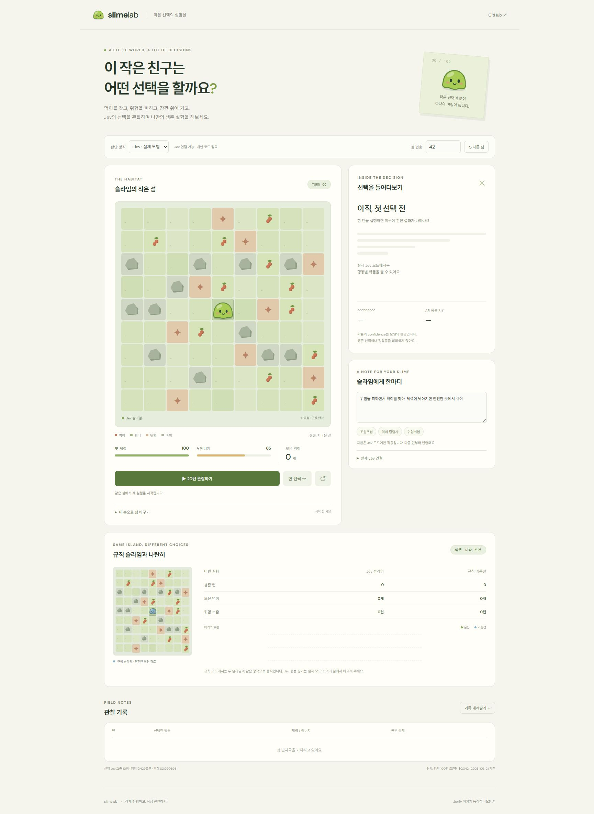
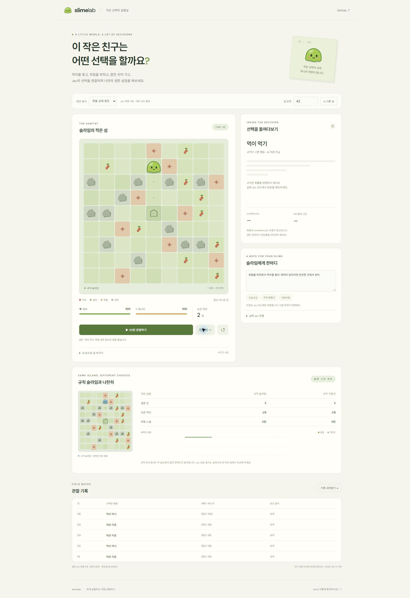
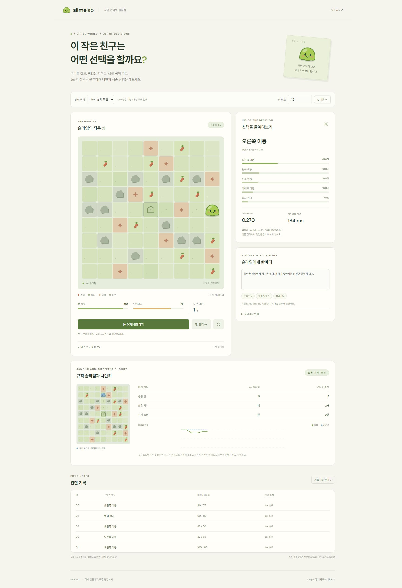
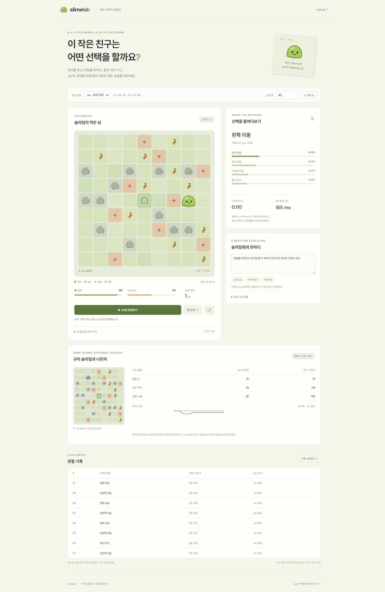

# Slime Lab · 작은 선택의 실험실

작은 2D 섬에서 슬라임의 행동을 관찰하고 실제 Jev와 결정론적 기준선을 비교합니다. 공개 무료 규칙 모드와 개인 코드로 여는 실제 Jev 모드를 구분합니다.

[공개 실험실 열기](https://jev-slime-lab.vercel.app) · [실제 화면과 검증 기록](docs/VERIFICATION.md)

## Jev 연결 전후: 같은 섬의 10턴

2026-09-21 공개 배포에서 직접 실행한 화면입니다. 여기서 **연결 전**은 Jev를 호출하지 않는 무료 규칙 모드, **연결 후**는 실제 `jev-1.13.0` 응답으로 행동하는 모드입니다. 화면 디자인 변경 전후가 아니라 판단 방식의 비교입니다.

두 실행 모두 섬 번호 **42**, 지형 편집 없음, 시작 체력 **100**·에너지 **65**, 같은 브라우저 폭 **1,729px**을 사용했습니다. 지침은 “위험을 피하면서 먹이를 찾아. 체력이 낮아지면 안전한 곳에서 쉬어.”로 고정했습니다. 규칙 모드는 지침을 읽지 않습니다. 0턴에서 다시 시작해 한 턴씩 10번 실행했고, 아래는 실제 화면 원본입니다. 이미지를 누르면 크게 볼 수 있습니다.

| 진행 | 연결 전 · 무료 규칙 | 연결 후 · 실제 Jev | 관찰 포인트 |
| --- | --- | --- | --- |
| 시작 · 0턴 |  |  | 같은 섬의 중앙 쉼터에서 시작 |
| 중간 · 5턴 |  |  | 규칙은 먹이 2개, Jev는 위험 구역을 한 번 지나 먹이 1개 획득 |
| 결과 · 10턴 |  |  | 이동 경로·체력·먹이 수와 실제 행동 확률 비교 |

| 10턴 종료 시점 | 무료 규칙 | 실제 Jev |
| --- | --- | --- |
| 체력 / 에너지 | 100 / 95 | 90 / 50 |
| 모은 먹이 | 3개 | 1개 |
| 위험 노출 | 0턴 | 1턴 |
| 실제 API 호출 | 0회 | 10회 |
| 입력 토큰 | 0 | 9,429 |
| 추정 API 사용액 | $0 | $0.000396 |

규칙은 위쪽 먹이부터 안전한 최단 경로로 이동했습니다. Jev는 오른쪽으로 이동하며 2턴에 위험 구역을 밟고, 4턴에 먹이를 먹었습니다. 이후 5~10턴에는 오른쪽과 왼쪽을 번갈아 선택했습니다. 마지막 선택은 왼쪽 이동(확률 33.0%, confidence 0.110, API 왕복 165ms)이었습니다. **이 실행에서는 규칙의 결과가 더 좋았습니다.** 단일 섬·지침·10턴의 관찰이므로 Jev 전체 성능 평가나 재실행 시 동일 결과를 보장하지 않습니다.

[규칙 10턴 화면 텍스트](docs/evidence/compare-rule-10.txt) · [Jev 10턴 화면 텍스트](docs/evidence/compare-jev-10.txt) · [Jev 매 턴 판단 패널 기록](docs/evidence/compare-jev-decisions.json). 텍스트 기록은 화면에 표시된 값이며 API 원문이 아닙니다. 비용은 성공 응답의 입력 토큰 기준 추정치로 카드 청구액과 다릅니다. 무료 규칙 모드와 무료 크레딧으로 사용하는 실제 Jev API도 서로 다릅니다.

## 실행

Node.js 24 LTS 권장. `npm ci`, `npm run dev`로 시작합니다. `npm run lint`, `npm run typecheck`, `npm test`, `npm run build`로 검증합니다.

Chrome 설치 및 실제 키/코드 설정 후 `node scripts/verify.mjs http://127.0.0.1:5173`으로 브라우저 흐름을 검증합니다. 실제 Jev를 5회 호출하므로 소액의 API 사용량이 발생합니다. 선택적으로 두 번째 URL 인수에 AI Action Review Console 주소를 전달하면 그 사이트의 피드백 흐름도 함께 확인합니다.

`.env.example`을 `.env.local`로 복사하고 `TYPESAFE_API_KEY`와 추측하기 어려운 `JEV_ACCESS_CODE`를 설정하면 실제 Jev 모드를 사용할 수 있습니다. 키와 코드는 Git에 포함하지 않습니다. Vercel 배포에서는 같은 이름의 서버 환경 변수를 설정합니다. Vite는 클라이언트에 `VITE_` 변수만 노출하며 이 앱은 비밀에 그 접두사를 사용하지 않습니다.

## 사용

- 같은 섬 번호는 같은 지형을 생성합니다. 시작 전 먹이·위험·바위를 편집하면 기준선에도 동일하게 적용됩니다.
- 한 턴씩 실행하거나 20턴 단위로 관찰합니다. 숨긴 탭은 자동 중지하고 실행 도중 재시작하면 오래된 응답을 적용하지 않습니다.
- Jev는 게임 상태·한국어 행동 지침·가능한 행동만 받아 Choice를 반환합니다. 이동, 피해, 먹이 소비, 종료는 코드가 계산합니다.
- 기준선은 먹기 → 필요시 쉼터 회복 → 위험을 피하는 최단 경로로 먹이 찾기 → 쉬기 정책이며 사용자 지침을 읽지 않습니다.
- 한 행동마다 에너지 5를 소비합니다. 먹기는 에너지 35·체력 8 회복, 휴식은 쉼터 15·그 외 4 회복. 위험 타일에서는 매 턴 체력 18 감소, 에너지 0에서는 추가 12 감소합니다. 음식은 재생성되지 않습니다. 체력 0 또는 100턴에 종료합니다.
- JSON 관찰 기록에는 초기 지도, 행동, 지침, 실제 확률, 모델 버전과 사용량을 남깁니다. 개인 코드와 API 키는 포함하지 않습니다.

## 관찰의 경계

확률 및 confidence는 Jev 응답 원본이며 정확도나 생존 보장이 아닙니다. 규칙 모드에는 확률을 만들지 않습니다. API 오류·타임아웃·잘못된 응답은 턴을 진행하지 않으며 규칙 결과로 조용히 대체하지 않습니다. 기준선이 종료된 후에는 최종 체력을 유지해 표시합니다. 턴 수는 실행한 턴 수이며 마지막 사망 턴을 포함합니다.

토큰 비용 표시는 공식 단가(입력 100만 토큰당 $0.042, 2026-09-21)에 성공 응답의 `input_tokens`를 곱한 추정치입니다. 세금·호스팅·실패/중단된 유료 요청은 포함하지 않습니다. 누적값은 탭 새로고침 시 초기화합니다. API 왕복 시간에는 공급자 네트워크 시간이 포함되며 모델 내부 추론 시간과 다릅니다.

개인 코드가 없는 방문자는 비용 없는 규칙 모드만 사용할 수 있습니다. 개인 코드는 소규모 실험용 접근 제어이며 다중 사용자 인증이나 계정별 과금 시스템이 아닙니다. 자동 20턴/100턴 상한은 UI 제어이며 계정 전체 지출 한도가 아닙니다. TypeSafe의 크레딧/과금 설정도 직접 확인하세요. 입력 지침과 게임 상태는 실제 모드에서 TypeSafe로 전송되며 이 앱은 이를 DB에 저장하지 않습니다.

## 구조

`src/game.ts`: 결정론적 시뮬레이션 / `src/main.ts`: UI와 실행 생명주기 / `server/jev.ts`: 제한된 Choice API 및 응답 검증 / `api/decide.ts`: 서버 자격 확인과 입력 검증. 프런트엔드 런타임 의존성 없이 Vite·TypeScript·HTML/CSS/SVG로 구현합니다. 외부 글꼴 로드 실패 시 시스템 글꼴로 대체됩니다.

[TypeSafe 공식 API](https://docs.typesafe.ai/api) · [confidence](https://docs.typesafe.ai/confidence) · [가격](https://docs.typesafe.ai/models)
