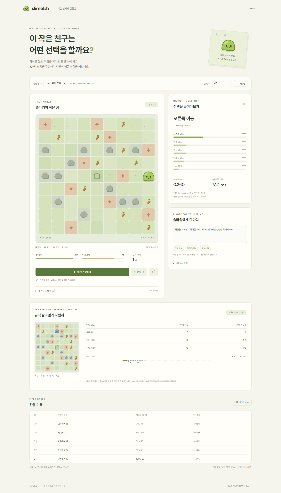
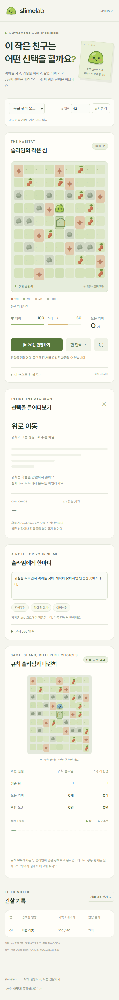

# 검증 기록 · 2026-09-21

- lint, TypeScript, 단위 테스트 9개, production build 통과.
- 100개 seed에서 규칙 기준선의 유효 행동과 100턴 이내 종료 확인.
- 브라우저: Chrome 1440×1000 / 390×844, 실제 Jev 5턴, 동일 맵 편집, 규칙 기준선, API 오류 시 턴 보존, 실행 중 초기화 후 오래된 응답 무시, 자동 관찰 중단, JSON 다운로드 확인.
- 실제 응답 `jev-1.13.0`의 선택 확률, 별도 confidence, 입력 토큰, API 왕복 시간을 관찰 기록에 보존. 내부 추론 과정은 관측하지 않음.
- 민감값은 `.env.local`과 Vercel 서버 환경 변수에만 저장. 미인증 방문자는 실제 호출 불가.
- 개발 서버 확인에 agent-browser, 흐름 검증에 Playwright를 사용함. 브라우저 오류 없음, 두 뷰포트 수평 넘침 없음.

## 실제 실행 화면

| 데스크톱 · 실제 Jev 5턴 | 모바일 · 무료 규칙 모드 |
| --- | --- |
|  |  |

`evidence/slime-live-record.json`은 합성 게임 상태만 포함한 실제 호출 기록이다. 기록 속 확률은 재현 보장이 아닌 해당 실행의 관측값이다. 네트워크 장애·취소 검증에 사용한 fixture는 실제 Jev 기록에 포함하지 않았다.

## 한계

소수의 섬 실행은 Jev의 일반 성능을 입증하지 않는다. 실제 모바일 기기가 아닌 Chrome 모바일 뷰포트 검증이다. 개인 코드를 공유한 사람의 비용은 운영자 계정에 청구될 수 있다. 사용자 계정 전체 지출 한도와 다중 사용자 인증은 구현 범위 밖이다. 프런트엔드 자동 실행 제한은 보안 상한이 아니다.
